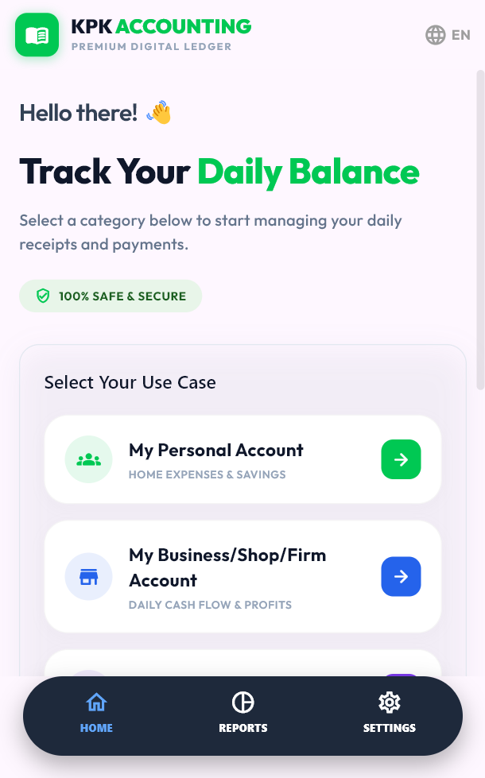

# Kaccha Pakka Khata 💎

> **A high-fidelity, secure personal utility application demonstrating modern Flutter architecture and premium UI/UX design.**

This project is a showcase of engineering excellence, built to demonstrate **scalable code**, **pixel-perfect implementation**, and **seamless user experiences**. It handles secure data, real-time synchronization, and professional-grade report generation.

## 🚀 Technical Highlights

Designed with a focus on code quality and performance:

-   **💎 Premium UI/UX**: Custom-designed interfaces with smooth transitions and responsive layouts that adapt from mobile to web.
-   **🔐 Robust Authentication**: Secure, production-ready login flows including **Google Sign-In**, OTP verification, and state persistence via **Supabase**.
-   **🛡️ Clean Architecture**: Modular codebase emphasizing separation of concerns, maintainability, and testability.
-   **📄 Advanced Features**: Integrated PDF generation engine for exporting professional documents directly from the app.
-   **⚡ Performance**: Optimized for 60fps rendering and instant load times.

## 🎨 App Preview

An interface designed to delight.

  

> *This project represents a commitment to high standards in mobile development, combining aesthetic sensibility with solid engineering principles.*

---
*Built with ❤️ using Flutter.*
